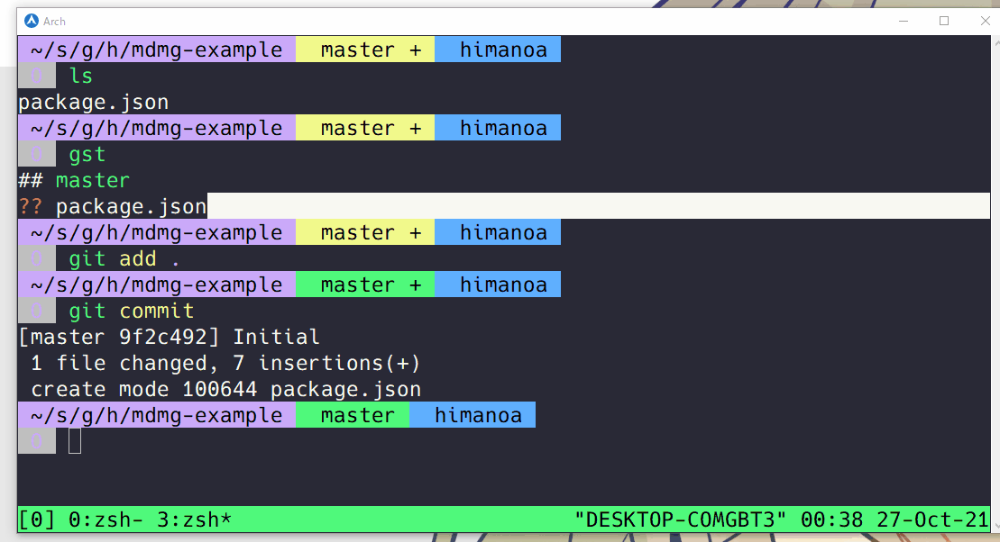

# Mdmg

A scaffold prototype code tool.



## Install

```bash
cargo install mdmg
```

### Debian

1. Dowload a latest deb package from https://github.com/himanoa/mdmg/releases

```
dpkg -i mdmg_[version]_amd64.deb
```

### macOS

Use homebrew

```
brew install -s himanoa/tap/mdmg
```
## Features 

- Markdown driven
  - Inspiration of [scaffdog](https://github.com/cats-oss/scaffdog).
- Zero dependencies
- Zero configuration
- Don't use interactive shell.
  - Easy to reuse from your script and text editor.

## Usage

1. Current Directory move to your project directory.
2. Execute `mdmg setup`.
3. Create a file similar to the following `.mdmg/${plan_name}.md`.

~~~markdown
## src/main.rs

```rust
fn main() -> Result<()> {
    unimplemented!()
}
```
~~~

4. Execute `mdmg generate ${plan_name} foo`.

## Mdmg plan file format

Please write in the following format.

~~~markdown
## file_name

```
file_body
```
~~~

The key points are as follows.

- Write a filename in h2 tag
- Write a file body in code block where the next line
- ↑ is ok write multiple

## Template Engine

Mdmg plan markdown can be use [handlebars](https://github.com/sunng87/handlebars-rust) template.

Functions and variables that can be used.

### Supported variable

- `identify` The third argument of mdmg generate command.
  - Example. `mdmg generate foo bar` => bar

### Supported functions

- `pascal_case`
  - Example
    - identify: fooBarBaz
    - template: `{{pascal_case identify}}`
    - output: FooBarBaz
- `camel_case`
  - Example
    - identify: FooBarBaz
    - template: `{{camel_case identify}}`
    - output: fooBarBaz
- `kebab_case`
  - Example
    - identify: FooBarBaz
    - template: `{{kebab_case identify}}`
    - output: foo-bar-baz
- `snake_case`
  - Example
    - identify: FooBarBaz
    - template: `{{snake_case identify}}`
    - output: foo\_bar\_baz
- `env`:  
  - Example
    - environment: FOO=12
    - template: `{{env "FOO"}}`
    - output: 12

Implementation => https://github.com/himanoa/mdmg/blob/master/src/template.rs

## Contributing

See https://github.com/himanoa/mdmg/blob/master/CONTRIBUTING.md
